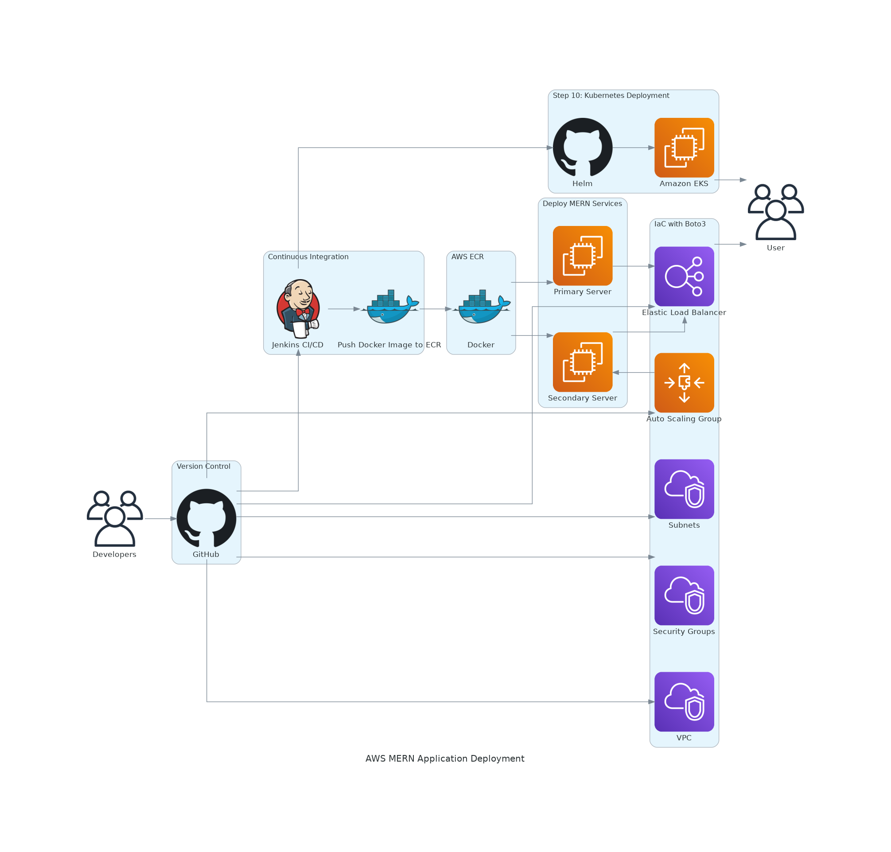
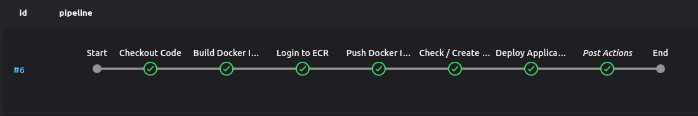
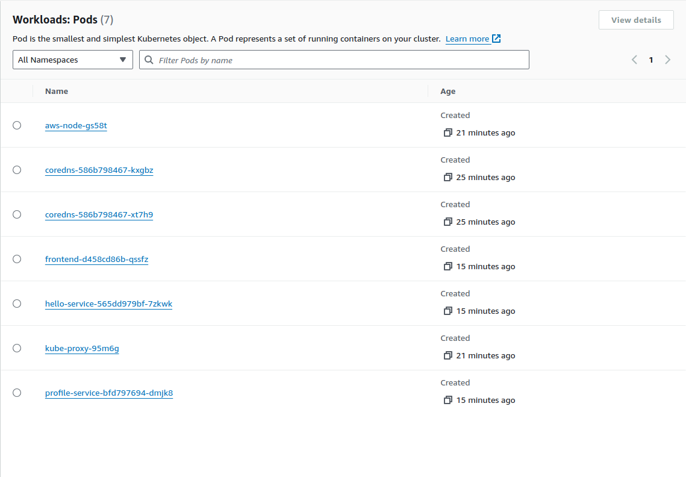
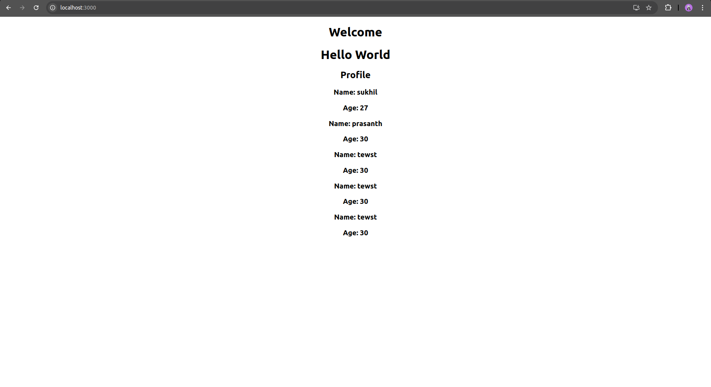

# Deploying a MERN Application on AWS with CI/CD and Kubernetes
This README will guide you through the entire process of deploying a containerized MERN (MongoDB, Express, React, Node.js) application using AWS services, Jenkins for CI/CD, and Kubernetes (EKS) for container orchestration. It covers the setup of AWS CLI, containerization, continuous integration, deployment with Boto3.

## Prerequisites
Before proceeding, ensure you have the following:

1. An AWS account.
2. AWS CLI and Boto3 installed on your local system.

## Step-by-Step Guide
### Step 1: Set Up the AWS Environment
1.1 Install AWS CLI and Configure with AWS Credentials.

Install the AWS CLI using the [Offical Document of AWS ](https://docs.aws.amazon.com/cli/latest/userguide/getting-started-install.html)and configure it with your AWS account.
``` bash
aws configure
```
Provide your AWS Access Key, Secret Access Key, Region, and Output format.

1.2 Install Boto3 for Python

Install Boto3 using pip to interact with AWS services using Python.
```
pip install boto3
```
Verify the installation by running a basic script to check credentials:
```python
import boto3

session = boto3.Session()
credentials = session.get_credentials()
print(credentials)
```
### Step 2: Prepare the MERN Application
2.1 Containerize the MERN Application

To Create the docker for the frontend and the backend use the dockerfile in the repo. The Dockerfile is using node as the base docker.

2.2 Push Docker Images to Amazon ECR
Build Docker images.
```bash
docker build -t mern-application .
```
Create ECR repositories for each image using the AWS CLI.
```bash
aws ecr create-repository --repository-name mern-application
```
Authenticate Docker to the ECR registry, then tag and push your images:
```bash
aws ecr get-login-password | docker login --username AWS --password-stdin <your-aws-account-id>.dkr.ecr.<region>.amazonaws.com
docker tag mern-mern-application <your-aws-account-id>.dkr.ecr.<region>.amazonaws.com/mern-application:latest
docker push <your-aws-account-id>.dkr.ecr.<region>.amazonaws.com/mern-application:latest
```
### Step 3: Continuous Integration with Jenkins
3.1 Create Jenkins Jobs

Create Jenkins jobs to:
- Pull the source code from github.
- Build Docker image.
- Push the Docker image to Amazon ECR.

Jenkinsfile for the same can be found in the git repo.

### Step 4: Infrastructure as Code (IaC) with Boto3 &  Deploy Backend on EC2 with ASG
4.1 Define Infrastructure Using Boto3

`deployment.py` in the repo will do the following:
- Create EC2 instace.
- Create Keypair for EC2
- Create AMI from the primary EC2
- Create a Virtual Private Cloud (VPC).
- Define subnets and security groups.
- Create an Auto Scaling Group (ASG) for the backend EC2 instances.

The script will take care of deploying the Application with help of the userdata script.

### Step 5: Kubernetes (EKS) Deployment
5.1 Create EKS Cluster
Use eksctl or the AWS CLI to create an EKS cluster.

```bash
eksctl create cluster --name mern-cluster --region <region>
```
5.2 Deploy Application with Helm
Use Helm to deploy the MERN application on the EKS cluster.

Example Helm command:
```bash
helm install <deployement name> <chart path>
```
This step is covered in the groovy code of jenkins.

### Architectural Diagram



### Expected Output

#### Jenkins


#### EKS


#### Application

